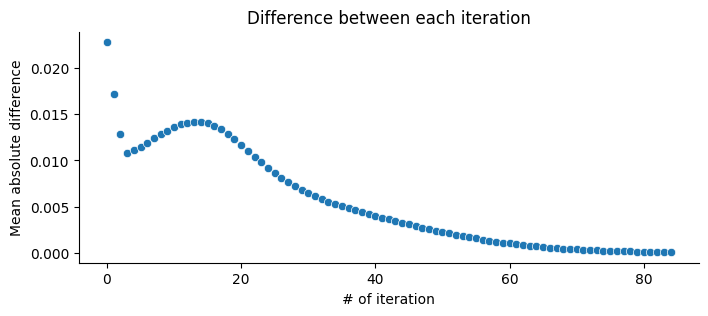
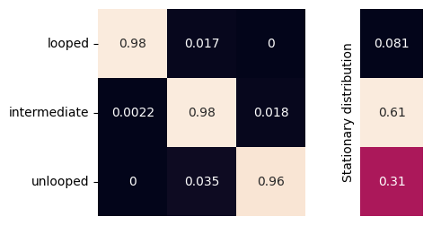
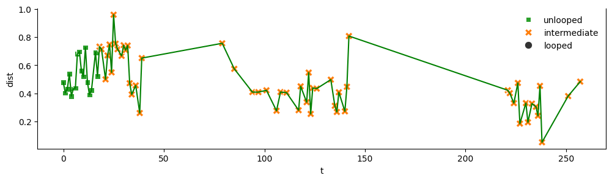
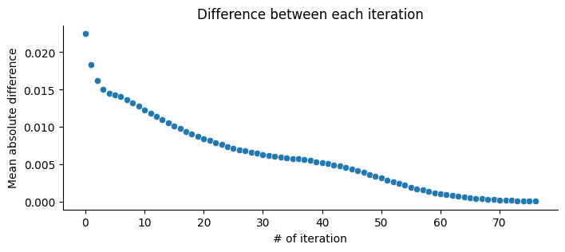
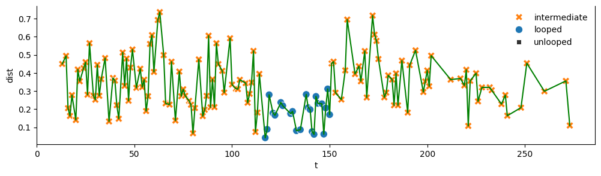

Loop state inference for *Fbn2* TAD in mESCs
--------------------------------------------

For this analysis, we use the data from `Gabriele et al
(2022) <https://www.science.org/doi/10.1126/science.abn6583>`__. The
data analyzed in this notebook are the C36 (wild type) and C65 (control)
strains.

.. code:: ipython3

    import os
    import numpy as np
    import pandas as pd
    from matplotlib import pyplot as plt
    import seaborn as sns
    from traceHMM.model import TraceModel
    from traceHMM.utils import plot as tplt

.. code:: ipython3

    %reload_ext autoreload
    %autoreload 2

Analysis of C65 - the control group
~~~~~~~~~~~~~~~~~~~~~~~~~~~~~~~~~~~

Read in data
^^^^^^^^^^^^

Please replace the ``data_dire`` with the relative path of the data
stored on your machine.

.. code:: ipython3

    data_dire = "../../../../gabriele_et_al_2023/data"
    control_path = os.path.join(data_dire, "C65.tagged_set.tsv")
    data = pd.read_csv(control_path, sep="\t")
    print(f"{control_path.split("/")[-1]} has {len(pd.unique(data.id))} trajectories")
    data.head()

.. parsed-literal::

    C65.tagged_set.tsv has 147 trajectories

.. raw:: html

    

    
    <table border="1" class="dataframe">
      <thead>
        <tr style="text-align: right;">
          <th></th>
          <th>id</th>
          <th>t</th>
          <th>x</th>
          <th>y</th>
          <th>z</th>
          <th>x2</th>
          <th>y2</th>
          <th>z2</th>
          <th>dist</th>
          <th>movie_index</th>
        </tr>
      </thead>
      <tbody>
        <tr>
          <th>0</th>
          <td>0</td>
          <td>1</td>
          <td>33.384880</td>
          <td>28.749708</td>
          <td>1.267213</td>
          <td>32.952367</td>
          <td>29.029923</td>
          <td>1.462896</td>
          <td>0.551252</td>
          <td>2020_09_03_movie1-03</td>
        </tr>
        <tr>
          <th>1</th>
          <td>0</td>
          <td>2</td>
          <td>33.377873</td>
          <td>28.654452</td>
          <td>1.225418</td>
          <td>32.798974</td>
          <td>28.968542</td>
          <td>1.258580</td>
          <td>0.659452</td>
          <td>2020_09_03_movie1-03</td>
        </tr>
        <tr>
          <th>2</th>
          <td>0</td>
          <td>3</td>
          <td>33.347297</td>
          <td>28.501661</td>
          <td>1.093382</td>
          <td>32.748908</td>
          <td>28.775660</td>
          <td>1.172601</td>
          <td>0.662888</td>
          <td>2020_09_03_movie1-03</td>
        </tr>
        <tr>
          <th>3</th>
          <td>0</td>
          <td>4</td>
          <td>33.410479</td>
          <td>28.231071</td>
          <td>1.050455</td>
          <td>32.805305</td>
          <td>28.571315</td>
          <td>1.108860</td>
          <td>0.696716</td>
          <td>2020_09_03_movie1-03</td>
        </tr>
        <tr>
          <th>4</th>
          <td>0</td>
          <td>7</td>
          <td>33.661071</td>
          <td>28.774886</td>
          <td>1.453220</td>
          <td>33.162907</td>
          <td>28.963981</td>
          <td>1.377385</td>
          <td>0.538214</td>
          <td>2020_09_03_movie1-03</td>
        </tr>
      </tbody>
    </table>
    

Reformat the data from long to wide via pivot then fit the model. Here
we assume there are three states: looped state, intermediate state, and
unlooped state, denoted by 0, 1, and 2, respectively.

For the model, we assume the distance at each state follows a normal
distribution with means and standard deviations (in µm) listed in
``dist_params``.

For the transition matrix, since we don’t want the chain jumps directly
either from looped to unlooped or from unlooped to looped, initializing
the corners of the matrix to 0 will ensure they are not updated during
fitting.

.. code:: ipython3

    many_available_ids = data.groupby("id").count().sort_values("t").index[-150:]
    sub_data = data[data.id.isin(many_available_ids.values)]
    
    pivoted = sub_data.pivot(index="t", columns="id", values="dist")
    X = pivoted.values.T
    dist_params = (
        {"loc":0.15, "scale":0.1},
        {"loc":0.3, "scale":0.2},
        {"loc":0.45, "scale":0.1}
    )
    P = np.array([
        [-1, -1,  0],
        [-1, -1, -1],
        [ 0, -1, -1]
    ])
    tm3 = TraceModel(X=X, Pm=P, dist_params=dist_params)
    tm3.fit(max_iter=200)

.. parsed-literal::

    Converged at iteration 85

There is a ``convergence`` attribute for ``TraceModel``, which records
the mean absolute difference of the transition matrix between two
consecutive iterations. We can plot this difference to see the
convergence of the model.

.. code:: ipython3

    fig, ax = plt.subplots(figsize=(8, 3))
    sns.scatterplot(tm3.convergence, ax=ax)
    ax.set(
        xlabel="# of iteration",
        ylabel="Mean absolute difference",
        title="Difference between each iteration"
    )
    plt.show()

Plot the fitted transition matrix
^^^^^^^^^^^^^^^^^^^^^^^^^^^^^^^^^

We can see that the corner elements are indeed fixed and are not
updated. Moreover, the stationary distribution shows that in the long
run, the trace only spends 4.5% of its time in the looped state. This
coincides with the experiment design as C65 is the control group.

.. code:: ipython3

    fig = tplt.plot_transition_matrix(tm3.P)

Plot some sample trajectories
^^^^^^^^^^^^^^^^^^^^^^^^^^^^^

.. code:: ipython3

    # some trace IDs in the data
    pd.unique(data.id)[:10]

.. parsed-literal::

    array([0, 1, 2, 3, 4, 5, 6, 7, 8, 9])

Note the decode method only accepts two-dimensional numpy array, with
each row being one trace.

.. code:: ipython3

    code_book = {0:"looped", 1:"intermediate", 2:"unlooped"}
    df = data[data.id==1].copy()
    df["state"] = tm3.decode(df["dist"].values[None,:])[0]
    fig, ax = tplt.plot_trace(df, "t", "dist", "state", code_book)

.. code:: ipython3

    df = data[data.id==6].copy()
    df["state"] = tm3.decode(df["dist"].values[None,:])[0]
    fig, ax = tplt.plot_trace(df, "t", "dist", "state", code_book)

.. image:: gabriele_et_al_files/gabriele_et_al_15_0.png

Analysis of C36 - the experiment group
~~~~~~~~~~~~~~~~~~~~~~~~~~~~~~~~~~~~~~

Here we just repeat the same analysis for C65 and see if there are any
difference.

.. code:: ipython3

    experiment_path = os.path.join(data_dire, "C36.tagged_set.tsv")
    data = pd.read_csv(experiment_path, sep="\t")
    print(f"{experiment_path.split("/")[-1]} has {len(pd.unique(data.id))} trajectories")
    data.head()

.. parsed-literal::

    C36.tagged_set.tsv has 491 trajectories

.. raw:: html

    

    
    <table border="1" class="dataframe">
      <thead>
        <tr style="text-align: right;">
          <th></th>
          <th>id</th>
          <th>t</th>
          <th>x</th>
          <th>y</th>
          <th>z</th>
          <th>x2</th>
          <th>y2</th>
          <th>z2</th>
          <th>dist</th>
          <th>movie_index</th>
        </tr>
      </thead>
      <tbody>
        <tr>
          <th>0</th>
          <td>0</td>
          <td>6</td>
          <td>21.402718</td>
          <td>28.628556</td>
          <td>5.736118</td>
          <td>21.410426</td>
          <td>28.615074</td>
          <td>5.612181</td>
          <td>0.124906</td>
          <td>2020_08_31_movie1-03</td>
        </tr>
        <tr>
          <th>1</th>
          <td>0</td>
          <td>7</td>
          <td>21.842653</td>
          <td>28.646646</td>
          <td>5.347591</td>
          <td>21.865756</td>
          <td>28.661069</td>
          <td>5.405542</td>
          <td>0.064032</td>
          <td>2020_08_31_movie1-03</td>
        </tr>
        <tr>
          <th>2</th>
          <td>0</td>
          <td>9</td>
          <td>21.699202</td>
          <td>28.473489</td>
          <td>5.245348</td>
          <td>21.678237</td>
          <td>28.464744</td>
          <td>5.218815</td>
          <td>0.034929</td>
          <td>2020_08_31_movie1-03</td>
        </tr>
        <tr>
          <th>3</th>
          <td>0</td>
          <td>10</td>
          <td>21.706599</td>
          <td>28.822224</td>
          <td>5.717446</td>
          <td>21.709891</td>
          <td>28.841900</td>
          <td>5.522071</td>
          <td>0.196391</td>
          <td>2020_08_31_movie1-03</td>
        </tr>
        <tr>
          <th>4</th>
          <td>0</td>
          <td>11</td>
          <td>22.203565</td>
          <td>28.649616</td>
          <td>5.512207</td>
          <td>22.193264</td>
          <td>28.564196</td>
          <td>5.497887</td>
          <td>0.087223</td>
          <td>2020_08_31_movie1-03</td>
        </tr>
      </tbody>
    </table>
    

.. code:: ipython3

    many_available_ids = data.groupby("id").count().sort_values("t").index[-150:]
    sub_data = data[data.id.isin(many_available_ids.values)]
    
    pivoted = sub_data.pivot(index="t", columns="id", values="dist")
    X = pivoted.values.T
    dist_params = (
        {"loc":0.15, "scale":0.1},
        {"loc":0.3, "scale":0.2},
        {"loc":0.45, "scale":0.1}
    )
    P = np.array([
        [-1, -1,  0],
        [-1, -1, -1],
        [ 0, -1, -1]
    ])
    tme = TraceModel(X=X, Pm=P, dist_params=dist_params)
    tme.fit(max_iter=200)

.. parsed-literal::

    Converged at iteration 77

.. code:: ipython3

    fig, ax = plt.subplots(figsize=(8, 3))
    sns.scatterplot(tme.convergence, ax=ax)
    ax.set(
        xlabel="# of iteration",
        ylabel="Mean absolute difference",
        title="Difference between each iteration"
    )
    plt.show()

.. code:: ipython3

    fig = tplt.plot_transition_matrix(tme.P)

.. image:: gabriele_et_al_files/gabriele_et_al_20_0.png

.. code:: ipython3

    pd.unique(sub_data.id)[10:20]

.. parsed-literal::

    array([22, 34, 37, 39, 40, 44, 48, 52, 56, 59])

.. code:: ipython3

    df = sub_data[sub_data.id==34].copy()
    df["state"] = tme.decode(df["dist"].values[None,:])[0]
    fig, ax = tplt.plot_trace(df, "t", "dist", "state", code_book)

