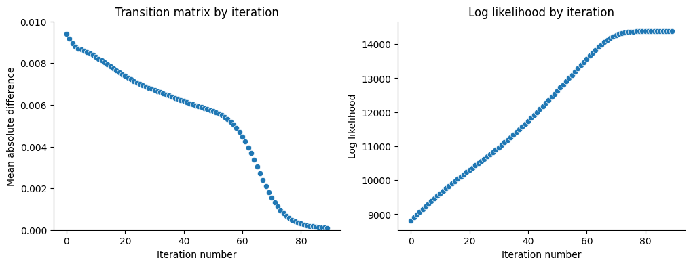
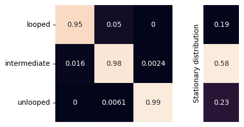
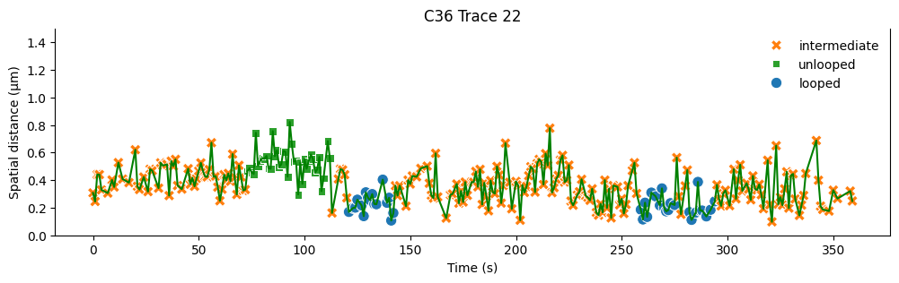
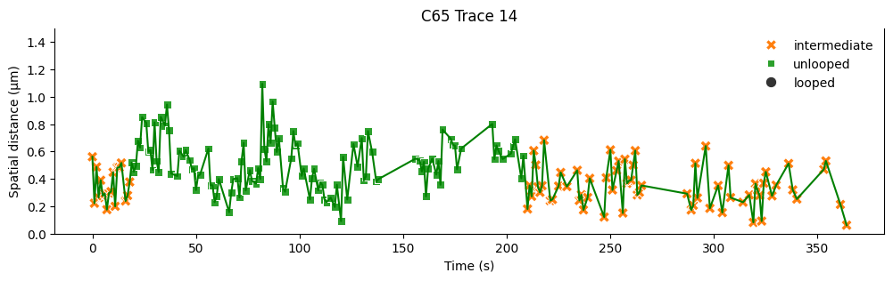
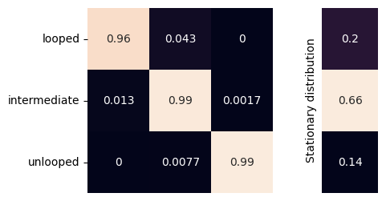

Loop state inference for *Fbn2* TAD in mESCs
============================================

For this analysis, we use the data from `Gabriele et al
(2022) <https://www.science.org/doi/10.1126/science.abn6583>`__. The
data analyzed in this notebook are the C36 (wild type) and C65 (control)
strains.

.. code:: ipython3

    data_dire = "../../gabriele_et_al_2023/data"

.. code:: ipython3

    import os
    import numpy as np
    import pandas as pd
    from matplotlib import pyplot as plt
    import seaborn as sns
    import traceHMM

.. code:: ipython3

    %reload_ext autoreload
    %autoreload 2

Reproduce the 4DN hackathon results
~~~~~~~~~~~~~~~~~~~~~~~~~~~~~~~~~~~

First, read in both the control and the experimental groups. The ``id``
column indicates which trace each row belongs to, and ``t`` records the
time point.

.. code:: ipython3

    path = os.path.join(data_dire, "C65.tagged_set.tsv")
    data65 = pd.read_csv(path, sep="\t")
    print(f"{path.split("/")[-1]} has {len(pd.unique(data65.id))} trajectories")
    print(data65.head().to_string())
    
    path = os.path.join(data_dire, "C36.tagged_set.tsv")
    data36 = pd.read_csv(path, sep="\t")
    print(f"{path.split("/")[-1]} has {len(pd.unique(data36.id))} trajectories")
    print(data36.head().to_string())

.. parsed-literal::

    C65.tagged_set.tsv has 147 trajectories
       id  t          x          y         z         x2         y2        z2      dist           movie_index
    0   0  1  33.384880  28.749708  1.267213  32.952367  29.029923  1.462896  0.551252  2020_09_03_movie1-03
    1   0  2  33.377873  28.654452  1.225418  32.798974  28.968542  1.258580  0.659452  2020_09_03_movie1-03
    2   0  3  33.347297  28.501661  1.093382  32.748908  28.775660  1.172601  0.662888  2020_09_03_movie1-03
    3   0  4  33.410479  28.231071  1.050455  32.805305  28.571315  1.108860  0.696716  2020_09_03_movie1-03
    4   0  7  33.661071  28.774886  1.453220  33.162907  28.963981  1.377385  0.538214  2020_09_03_movie1-03
    C36.tagged_set.tsv has 491 trajectories
       id   t          x          y         z         x2         y2        z2      dist           movie_index
    0   0   6  21.402718  28.628556  5.736118  21.410426  28.615074  5.612181  0.124906  2020_08_31_movie1-03
    1   0   7  21.842653  28.646646  5.347591  21.865756  28.661069  5.405542  0.064032  2020_08_31_movie1-03
    2   0   9  21.699202  28.473489  5.245348  21.678237  28.464744  5.218815  0.034929  2020_08_31_movie1-03
    3   0  10  21.706599  28.822224  5.717446  21.709891  28.841900  5.522071  0.196391  2020_08_31_movie1-03
    4   0  11  22.203565  28.649616  5.512207  22.193264  28.564196  5.497887  0.087223  2020_08_31_movie1-03

Calculate the variance of each state using the variance from the C65
group.

.. code:: ipython3

    cols = ["x", "y", "z"]
    for c in cols:
        for df in [data36, data65]:
            df[f"d{c}"] = df[c] - df[f"{c}2"]
    null_cov = data65[["dx", "dy", "dz"]].var(axis=0)
    null_cov = np.diag(null_cov)
    r = 0.15 # loop state variance is 15% of unloop state
    covs = np.stack([null_cov*v for v in np.linspace(r, 1, 3)])
    covs

.. parsed-literal::

    array([[[0.01453355, 0.        , 0.        ],
            [0.        , 0.01322972, 0.        ],
            [0.        , 0.        , 0.01580395]],
    
           [[0.05571193, 0.        , 0.        ],
            [0.        , 0.05071393, 0.        ],
            [0.        , 0.        , 0.06058182]],
    
           [[0.09689032, 0.        , 0.        ],
            [0.        , 0.08819814, 0.        ],
            [0.        , 0.        , 0.10535968]]])

Reshape the dataframe to a three dimensional numpy array.

.. code:: ipython3

    X36 = traceHMM.func.long_to_tensor(data36, t_col="t", id_col="id", val_cols=["dx", "dy", "dz"])
    print("Array shape for C36 (N, T, S):", X36.shape)
    X65 = traceHMM.func.long_to_tensor(data65, t_col="t", id_col="id", val_cols=["dx", "dy", "dz"])
    print("Array shape for C65 (N, T, S):", X65.shape)

.. parsed-literal::

    Array shape for C36 (N, T, S): (491, 365, 3)
    Array shape for C65 (N, T, S): (147, 365, 3)

Here, the chain is not allowed to jump directly from unlooped to looped
or looped to unlooped. This is achived by setting the corner elements of
the transition matrix to 0 while leaving other entries to be negative
(negative value -> will be updated in fitting, see more in API
Reference).

.. code:: ipython3

    dist_params = ({"cov":covs[0]}, {"cov":covs[1]}, {"cov":covs[2]})
    tm36 = traceHMM.TraceModel(
        X=X36, Pm=np.array([
            [-1, -1,  0],
            [-1, -1, -1],
            [ 0, -1, -1]
        ]),
        dist_params=dist_params,
        dist_type=traceHMM.model.multivariate_normal,
    )
    tm36.fit(max_iter=200)

.. parsed-literal::

    Converged at iteration 90

There is a ``convergence`` attribute for ``TraceModel``, which records
the mean absolute difference of the transition matrix between two
consecutive iterations. We can plot this difference to see the
convergence of the model. In addition, we plot the log-likelihood at
each iteration to check the model fit.

.. code:: ipython3

    fig, axes = plt.subplots(1, 2, figsize=(12, 4))
    sns.scatterplot(tm36.convergence, ax=axes[0])
    axes[0].set(
        xlabel="Iteration number", ylabel="Mean absolute difference",
        title="Transition matrix by iteration", ylim=(0, 0.01)
    )
    sns.scatterplot(tm36.lklhd, ax=axes[1])
    axes[1].set(
        xlabel="Iteration number", ylabel="Log likelihood",
        title="Log likelihood by iteration"
    )
    plt.show()

The fitted transition matrix and its corresponding stationary
distribution is shown below:

.. code:: ipython3

    fig = traceHMM.plot.plot_transition_matrix(tm36.P)

Decode the observed traces with the fitted model shows that the chain
spends about 7% time in the looped state.

.. code:: ipython3

    counts = np.unique(tm36.decode(), return_counts=True)[1]
    print(f"C36 Loop fraction: {np.round(counts[0]/sum(counts), 4)*100}%")
    counts = np.unique(tm36.decode(X65), return_counts=True)[1]
    print(f"C65 Loop fraction: {np.round(counts[0]/sum(counts), 4)*100}%")

.. parsed-literal::

    C36 Loop fraction: 7.39%
    C65 Loop fraction: 4.05%

Below we show some sample traces from C36 and C65, along with their
decoded states:

.. code:: ipython3

    traceHMM.func.add_predictions_to_df(data36, tm36.decode(), X=X36)
    traceHMM.func.add_predictions_to_df(data65, tm36.decode(X65), X=X65)

.. code:: ipython3

    code_book = {0:"looped", 1:"intermediate", 2:"unlooped"}
    df = data36[data36["id"]==22]
    fig, ax = traceHMM.plot.plot_trace(df, "t", "dist", "state", code_book)
    ax.set(ylim=(0, 1.5), xlabel="Time (s)", ylabel="Spatial distance (µm)", title="C36 Trace 22")
    plt.show()

.. code:: ipython3

    code_book = {0:"looped", 1:"intermediate", 2:"unlooped"}
    df = data65[data65["id"]==14]
    fig, ax = traceHMM.plot.plot_trace(df, "t", "dist", "state", code_book)
    ax.set(ylim=(0, 1.5), xlabel="Time (s)", ylabel="Spatial distance (µm)", title="C65 Trace 14")
    plt.show()

--------------

Fit with localization errors
~~~~~~~~~~~~~~~~~~~~~~~~~~~~

.. code:: ipython3

    exp_dist = np.array([0.15, 0.4, 0.6])
    var_ls = exp_dist**2/3
    dist_params = tuple([{"cov":np.identity(3)*var_ls[i]} for i in range(3)])
    tm = traceHMM.TraceModel(
        X=X36, Pm=np.array([
            [-1, -1,  0],
            [-1, -1, -1],
            [ 0, -1, -1]
        ]),
        dist_params=dist_params,
        dist_type=traceHMM.model.multivariate_normal,
        update_dist_params=["err"]
    )
    tm.fit(600)

.. parsed-literal::

    Converged at iteration 63

.. code:: ipython3

    tm.loc_err

.. parsed-literal::

    array([0.        , 0.        , 0.10753076])

.. code:: ipython3

    fig = traceHMM.plot.plot_transition_matrix(tm.P)

.. code:: ipython3

    counts = np.unique(tm.decode(), return_counts=True)[1]
    print(f"C36 Loop fraction: {np.round(counts[0]/sum(counts), 4)*100}%")
    counts = np.unique(tm.decode(X65), return_counts=True)[1]
    print(f"C65 Loop fraction: {np.round(counts[0]/sum(counts), 4)*100}%")

.. parsed-literal::

    C36 Loop fraction: 8.260000000000002%
    C65 Loop fraction: 4.19%

