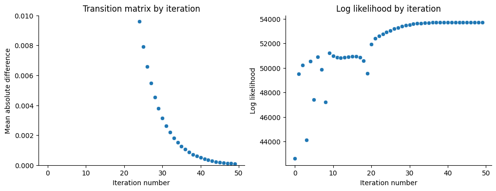
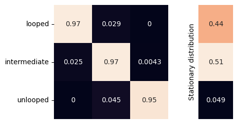

Loop state inference for TetO array insertion in mESCs
======================================================

For this analysis, we use the data from Mach et al (2022). The data
analyzed in this notebook are the 1B1 0min (wild type) and 1B1 120min
(RAD21 depleted).

.. code:: ipython3

    import os
    import numpy as np
    import pandas as pd
    from matplotlib import pyplot as plt
    import seaborn as sns
    import traceHMM

.. code:: ipython3

    %reload_ext autoreload
    %autoreload 2

Fit with localization errors
~~~~~~~~~~~~~~~~~~~~~~~~~~~~

.. code:: ipython3

    path = "../../mach_et_al_2023/two_colors"
    write = "../mach_data_cleaned"
    files = []
    for f in os.listdir(path):
        if f != ".DS_Store":
            id_line = "_".join(f.split("_")[3:5])
            files.append([id_line, os.path.join(path, f)])
    files = pd.DataFrame(files, columns=["name", "f"])
    if not os.path.exists(write):
        os.mkdir(write)
    for name, df in files.groupby("name"):
        cc_df = pd.concat([pd.read_csv(f) for f in df["f"]])
        cc_df = cc_df.rename({"uniqueid":"id", "frame":"t"}, axis=1)
        cc_df = cc_df.astype({"t":"int64"})
        if write is not None:
            if not os.path.exists(write):
                os.mkdir(write)
            write_path = os.path.join(write, f"{name}.tsv")
            cc_df.to_csv(write_path, sep="\t", index=False)

.. code:: ipython3

    os.listdir(write)

.. parsed-literal::

    ['1A2_120min.tsv',
     '1F4_120min.tsv',
     '1B1_120min.tsv',
     '1A2_0min.tsv',
     '1F4_0min.tsv',
     '1B1_0min.tsv']

.. code:: ipython3

    data_1b1_0 = pd.read_csv(os.path.join(write, "1B1_0min.tsv"), sep="\t")
    X0 = traceHMM.func.long_to_tensor(data_1b1_0, id_col="id", t_col="t", val_cols=["x", "y", "z"])
    data_1b1_120 = pd.read_csv(os.path.join(write, "1B1_120min.tsv"), sep="\t")
    X120 = traceHMM.func.long_to_tensor(data_1b1_120, id_col="id", t_col="t", val_cols=["x", "y", "z"])

.. code:: ipython3

    data_1b1_120[["x", "y", "z"]].var(axis=0)

.. parsed-literal::

    x    0.038176
    y    0.038792
    z    0.102151
    dtype: float64

.. code:: ipython3

    data_1b1_120["distance"].mean()

.. parsed-literal::

    0.3742835648481378

.. code:: ipython3

    exp_dist = np.array([0.1, 0.2, 0.4])
    var_ls = exp_dist**2/3
    dist_params = tuple([{"cov":np.identity(3)*var_ls[i]} for i in range(3)])
    tm = traceHMM.TraceModel(
        X=X0, Pm=np.array([
            [-1, -1,  0],
            [-1, -1, -1],
            [ 0, -1, -1]
        ]),
        dist_params=dist_params,
        dist_type=traceHMM.model.multivariate_normal,
        update_dist_params=["err"]
    )
    tm.fit(600)

.. parsed-literal::

    Converged at iteration 50

.. code:: ipython3

    tm._dist_params[0]["err"]

.. parsed-literal::

    array([[0.        , 0.        , 0.        ],
           [0.        , 0.00023056, 0.        ],
           [0.        , 0.        , 0.0349791 ]])

.. code:: ipython3

    ig, axes = plt.subplots(1, 2, figsize=(12, 4))
    sns.scatterplot(tm.convergence, ax=axes[0])
    axes[0].set(
        xlabel="Iteration number", ylabel="Mean absolute difference",
        title="Transition matrix by iteration", ylim=(0, 0.01)
    )
    sns.scatterplot(tm.lklhd, ax=axes[1])
    axes[1].set(
        xlabel="Iteration number", ylabel="Log likelihood",
        title="Log likelihood by iteration"
    )
    plt.show()

.. code:: ipython3

    fig = traceHMM.plot.plot_transition_matrix(tm.P)

.. code:: ipython3

    counts = np.unique(tm.decode(), return_counts=True)[1]
    print(f"1B1 0min Loop fraction: {np.round(counts[0]/sum(counts)*100, 2)}%")
    counts = np.unique(tm.decode(X120), return_counts=True)[1]
    print(f"1B1 120min Loop fraction: {np.round(counts[0]/sum(counts)*100, 2)}%")

.. parsed-literal::

    1B1 0min Loop fraction: 38.25%
    1B1 120min Loop fraction: 3.87%

