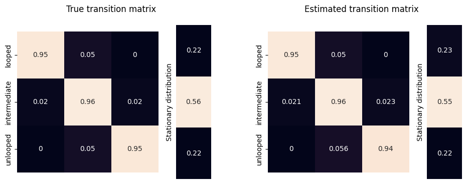

Demo: simulate a live cell imaging dataset
==========================================

.. code:: ipython3

    import pandas as pd
    import numpy as np
    import seaborn as sns
    from matplotlib import pyplot as plt
    import traceHMM

.. code:: ipython3

    %reload_ext autoreload
    %autoreload 2

Test traceHMM implementation with simulated data
~~~~~~~~~~~~~~~~~~~~~~~~~~~~~~~~~~~~~~~~~~~~~~~~

Here, we generate a simulated live cell imaging data using the
``TraceSimulator`` class in the ``traceHMM`` package. The transition
probability and the covariance matrices are listed below.

We also want to simulate the missing data observed in typical live cell
imaging data. ``TraceSimulator`` class provides two methods to simulate
missing data:

1. Mask completely at random: at each time point, generate a 0-1 random
   variable. Mask the value if the random variable is 0.

2. Mask by a Markov chain: generate a 0-1 Markov chain to mask the
   generated data. To compute the transition matrix of this chain given
   desired observed probability, one also needs to specify
   :math:`\mathbb P(\text{stay unobserved})`, which fixes one element of
   the transition matrix and ensures a unique solution exists.

Here, we demonstrate the second approach and generate 400 traces each of
length 500.

.. code:: ipython3

    # transition probability between three states
    P = np.array([
        [0.95, 0.05,    0],
        [0.02, 0.96, 0.02],
        [   0, 0.05, 0.95]
    ])
    # measurement errors added to x, y, and z axes
    err = np.diag(np.square([0, 0.06, .12])*2)
    # variance at each state
    dist_params = (
            {"cov":np.diag(np.ones(3)*0.015), "err":err},
            {"cov":np.diag(np.ones(3)*0.055), "err":err},
            {"cov":np.diag(np.ones(3)*0.085), "err":err}
    )
    # a uniform initial distribution over the 3 states
    tse = traceHMM.TraceSimulator(
        P=P,
        mu=np.array([1/3, 1/3, 1/3]),
        dist_params=dist_params,
        dist_type=traceHMM.model.multivariate_normal,
        random_state=100
    )
    H, X0 = tse.simulate_multiple_traces(500, 400)
    X = tse.mask_by_markov_chain(X0, 0.5, a=0.8)

.. parsed-literal::

    P(stay observed) = 0.8

After generating the data, we want to check whether the model we
implemented can estimate the parameters accurately, given that we know
the correct variance at each state.

.. code:: ipython3

    dist_params = (
            {"cov":np.diag(np.ones(3)*0.015)},
            {"cov":np.diag(np.ones(3)*0.055)},
            {"cov":np.diag(np.ones(3)*0.085)}
    )
    tm = traceHMM.TraceModel(
        X=X, Pm=np.array([
            [-1, -1,  0],
            [-1, -1, -1],
            [ 0, -1, -1]
        ]), 
        dist_params=dist_params, 
        dist_type=traceHMM.model.multivariate_normal, 
        update_dist_params=["err"]
    )
    tm.fit(1e3)

.. parsed-literal::

    Converged at iteration 653

The model converges after 653 iterations. The ``TraceModel`` class uses
the mean absolute difference of the transition matrix between two
iterations as the convergence criterion. The model also has a ``lklhd``
attribute that records the log likelihood of the model at each
iteration. From the plot below, we see that the log-likelihood is
monotonically increasing, coherent with what we would expect from an
expectation-maximization process.

.. code:: ipython3

    fig, axes = plt.subplots(1, 2, figsize=(12, 4))
    sns.scatterplot(tm.convergence, ax=axes[0])
    axes[0].set(
        xlabel="Iteration number", ylabel="Mean absolute difference",
        title="Transition matrix by iteration", ylim=(0, 0.01)
    )
    sns.scatterplot(tm.lklhd, ax=axes[1])
    axes[1].set(
        xlabel="Iteration number", ylabel="Log likelihood",
        title="Log likelihood by iteration"
    )
    plt.show()

.. image:: simulations_files/simulations_8_0.png

The estimated measurement errors are listed below, which are close to
``[0, 0.06, 0.12]`` as specified in the data generation part.

.. code:: ipython3

    tm.loc_err

.. parsed-literal::

    array([0.        , 0.06102365, 0.11988821])

The estimated transition matrix is also close to the true transition
matrix, and both give a similar stationary distribution, showing that
the chain spends about 22% of time in the looped state in the long run.

.. code:: ipython3

    sfigs = plt.figure(figsize=(10, 4)).subfigures(1, 2)
    traceHMM.plot.plot_transition_matrix(P, sfigs[0])
    sfigs[0].suptitle("True transition matrix")
    traceHMM.plot.plot_transition_matrix(tm.P, sfigs[1])
    sfigs[1].suptitle("Estimated transition matrix")

.. parsed-literal::

    Text(0.5, 0.98, 'Estimated transition matrix')

Below are some traces along with their predicted/true looping profile.

.. code:: ipython3

    n = 1
    dist = np.linalg.norm(X[n], axis=1)
    df = pd.DataFrame({"dist":dist, "state":tm.decode(X[[n]])[0]})
    df = df.reset_index(names="t")
    df["true"] = H[n]
    code_book = {0:"looped", 1:"intermediate", 2:"unlooped"}
    fig, axes = plt.subplots(2, 1, figsize=(16, 6))
    traceHMM.plot.plot_trace(df, "t", "dist", "state", code_book, fig, axes[0])
    traceHMM.plot.plot_trace(df, "t", "dist", "true", code_book, fig, axes[1])
    axes[0].set(xlabel="Time (s)", ylabel="Spatial distance (µm)", title="Predicted loop states")
    axes[1].set(xlabel="Time (s)", ylabel="Spatial distance (µm)", title="True loop states")
    fig.tight_layout()

.. image:: simulations_files/simulations_14_0.png

.. code:: ipython3

    n = 2
    dist = np.linalg.norm(X[n], axis=1)
    df = pd.DataFrame({"dist":dist, "state":tm.decode(X[[n]])[0]})
    df = df.reset_index(names="t")
    df["true"] = H[n]
    code_book = {0:"looped", 1:"intermediate", 2:"unlooped"}
    fig, axes = plt.subplots(2, 1, figsize=(16, 6))
    traceHMM.plot.plot_trace(df, "t", "dist", "state", code_book, fig, axes[0])
    traceHMM.plot.plot_trace(df, "t", "dist", "true", code_book, fig, axes[1])
    axes[0].set(xlabel="Time (s)", ylabel="Spatial distance (µm)", title="Predicted loop states")
    axes[1].set(xlabel="Time (s)", ylabel="Spatial distance (µm)", title="True loop states")
    fig.tight_layout()

.. image:: simulations_files/simulations_15_0.png

Ignore the localization error
~~~~~~~~~~~~~~~~~~~~~~~~~~~~~

In this section, we demonstrate why including an additional estimate for
measurement error is helpful. Below, we fit a HMM without measurement
error assumption:

.. code:: ipython3

    dist_params = (
            {"cov":np.diag(np.ones(3)*0.015)},
            {"cov":np.diag(np.ones(3)*0.055)},
            {"cov":np.diag(np.ones(3)*0.085)}
    )
    tm2 = traceHMM.TraceModel(
        X=X, Pm=np.array([
            [-1, -1,  0],
            [-1, -1, -1],
            [ 0, -1, -1]
        ]), 
        dist_params=dist_params, 
        dist_type=traceHMM.model.multivariate_normal, 
    )
    tm2.fit(int(1e3))

.. parsed-literal::

    Converged at iteration 214

.. code:: ipython3

    fig, axes = plt.subplots(1, 2, figsize=(12, 4))
    sns.scatterplot(tm2.convergence, ax=axes[0])
    axes[0].set(
        xlabel="Iteration number", ylabel="Mean absolute difference",
        title="Transition matrix by iteration", ylim=(0, 0.01)
    )
    sns.scatterplot(tm2.lklhd, ax=axes[1])
    axes[1].set(
        xlabel="Iteration number", ylabel="Log likelihood",
        title="Log likelihood by iteration"
    )
    plt.show()

.. image:: simulations_files/simulations_18_0.png

The estimated transition matrix shows considerable difference from the
true one. In addition, with this model, we would say the long run loop
fraction is about 12% while the true fraction is twice the estimated
one.

.. code:: ipython3

    sfigs = plt.figure(figsize=(10, 4)).subfigures(1, 2)
    traceHMM.plot.plot_transition_matrix(P, sfigs[0])
    sfigs[0].suptitle("True transition matrix")
    traceHMM.plot.plot_transition_matrix(tm2.P, sfigs[1])
    sfigs[1].suptitle("Estimated transition matrix")

.. parsed-literal::

    Text(0.5, 0.98, 'Estimated transition matrix')

The estimated looping profile is also problematic, as shown below:

.. code:: ipython3

    n = 1
    dist = np.linalg.norm(X[n], axis=1)
    df = pd.DataFrame({"dist":dist, "state":tm2.decode(X[[n]])[0]})
    df = df.reset_index(names="t")
    df["true"] = H[n]
    code_book = {0:"looped", 1:"intermediate", 2:"unlooped"}
    fig, axes = plt.subplots(2, 1, figsize=(16, 6))
    traceHMM.plot.plot_trace(df, "t", "dist", "state", code_book, fig, axes[0])
    traceHMM.plot.plot_trace(df, "t", "dist", "true", code_book, fig, axes[1])
    axes[0].set(xlabel="Time (s)", ylabel="Spatial distance (µm)", title="Predicted loop states")
    axes[1].set(xlabel="Time (s)", ylabel="Spatial distance (µm)", title="True loop states")
    fig.tight_layout()

Loop Life Time
~~~~~~~~~~~~~~

Since the raw data contains missing values, it is difficult to calculate
the loop life time. Given we have already fitted a traceHMM, there are
two ways to estimate the average loop life time:

1. Monte Carlo approach: generate some samples according to the fitted
   transition matrix, and calculate the average loop life time of the
   sample.

2. First-step analysis of Markov chain: the expected loop life time is
   the expection of the hitting time from loop state to intermediate
   state:

   .. math::

       \mathbb E_0[\tau_1] = p_{11}(\mathbb E_0[\tau_1] + 1) + p_{12}(\mathbb E_1[\tau_1] + 1),
       

   where :math:`\mathbb E_i[\tau_j]` denotes the expectation of the
   hitting time from the :math:`i` th state to the :math:`j` th state.
   The solution is :math:`1/p_{12}`. That is, the average loop life time
   is just the inverse of the :math:`12` th entry of the transition
   matrix.

.. code:: ipython3

    tts = traceHMM.TraceSimulator(tm.P, np.ones(3)/3, dist_params, traceHMM.model.multivariate_normal, 0)
    Hm, Xm = tts.simulate_single_trace(1000000)

.. code:: ipython3

    traceHMM.func.avg_loop_life_time(Hm)

.. parsed-literal::

    19.761629412272374

.. code:: ipython3

    1/tm.P[0,1]

.. parsed-literal::

    19.83321708434932

Indeed, they return nearly the same value. The true average loop life
time is given below:

.. code:: ipython3

    traceHMM.func.avg_loop_life_time(H)

.. parsed-literal::

    19.68839966130398

which is very close to our estimates.

Polychrom simulations
~~~~~~~~~~~~~~~~~~~~~

A single chain consisting of 1000 monomers over 10,000 time points.
Bidirectional CTCF sites at the 200, 400, 600, and 800 monomer.

.. code:: ipython3

    import os, h5py, re
    poly_path = "../../hackathon/LE_1"
    paths = []
    for p in os.listdir(poly_path):
        res = re.search(r"^blocks_(\d+)-\d+\.h5", p)
        if bool(res):
            paths.append((os.path.join(poly_path, p), res[1]))
    paths = sorted(paths, key=lambda x: int(x[1]))

.. code:: ipython3

    arrs = []
    for p in paths:
        with h5py.File(p[0]) as f:
            for k in f.keys():
                arrs.append(f[k]["pos"][()])
    arrs = np.stack(arrs).transpose(1, 0, 2)

.. code:: ipython3

    ll, lr = 400, 600
    Xs = np.sqrt(np.sum(np.square(arrs[ll] - arrs[lr]), axis=-1))

.. code:: ipython3

    with h5py.File(os.path.join(poly_path, "LEFPos.h5")) as f:
        bond_pos = f["positions"][()]
    bond_pos.shape

.. parsed-literal::

    (10000, 4, 2)

.. code:: ipython3

    # all bonds are ordered: 1st pos < 2nd pos
    np.all(bond_pos[:,:,0]-bond_pos[:,:,1] <= 0)

.. parsed-literal::

    True

.. code:: ipython3

    # define loop if the bond is within lcut from the CTCF sites
    lcut = 20
    ll_filter = np.abs(bond_pos[:,:,0] - ll) < lcut
    lr_filter = np.abs(bond_pos[:,:,1] - lr) < lcut
    loop_states = np.any(ll_filter & lr_filter, axis=1)

.. code:: ipython3

    plot_df = pd.DataFrame({"loop":loop_states, "dist":Xs}).reset_index(names="t")
    
    fig, ax = plt.subplots(figsize=(16, 4))
    sns.scatterplot(plot_df.iloc[2000:3000], x="t", y="dist", hue="loop")

.. parsed-literal::

    <Axes: xlabel='t', ylabel='dist'>

